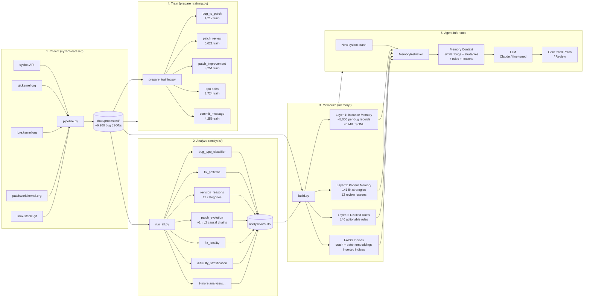
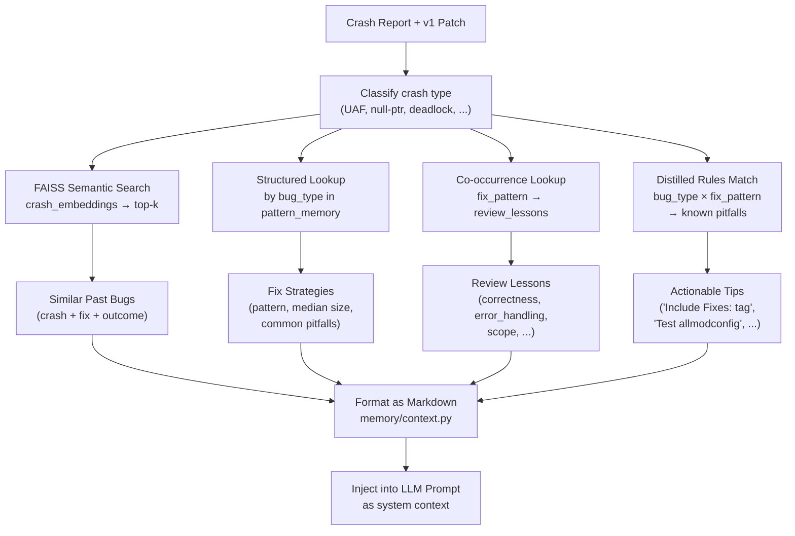
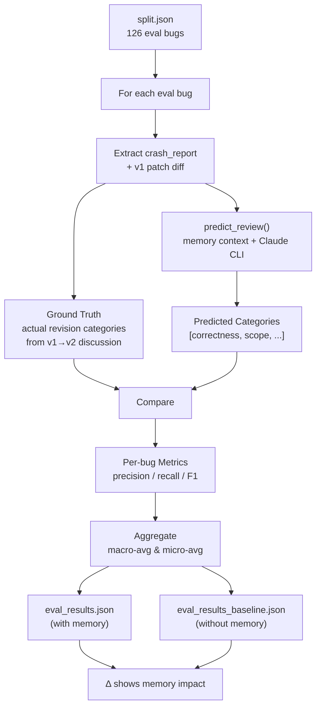
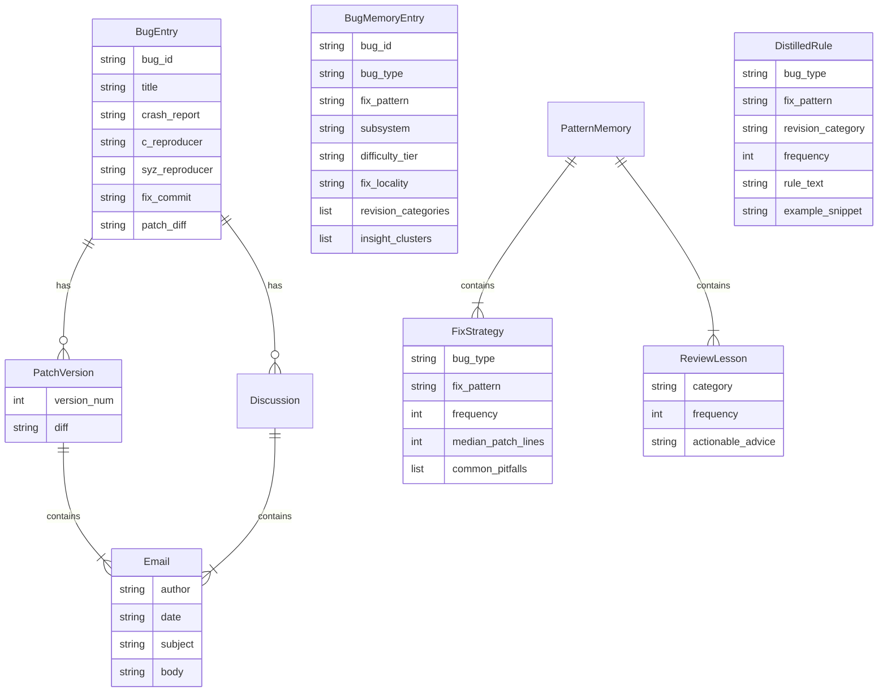
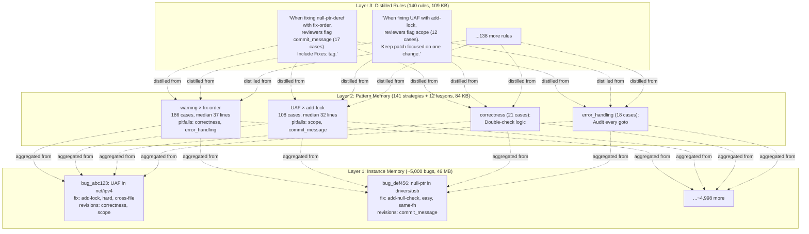

# SyzFix Architecture

## Mermaid Diagrams

### End-to-End Pipeline



### Memory Retrieval Flow



### Evaluation Pipeline



### Data Model



### Knowledge Layers



---

## System Overview (ASCII)

```
┌─────────────────────────────────────────────────────────────────────────────┐
│                              SyzFix Pipeline                                │
│                                                                             │
│  ┌───────────────┐    ┌───────────────┐    ┌───────────────┐                │
│  │  1. COLLECT    │───▶│  2. ANALYZE   │───▶│  3. MEMORIZE  │──┐            │
│  │  (syzbot-      │    │  (analysis/)   │    │  (memory/)     │  │            │
│  │   dataset/)    │    │               │    │               │  │            │
│  └───────────────┘    └───────────────┘    └───────────────┘  │            │
│         │                                         │            │            │
│         ▼                                         ▼            ▼            │
│  ┌───────────────┐                         ┌───────────────────────┐       │
│  │  4. TRAIN      │                         │  5. AGENT (inference) │       │
│  │  (SFT / DPO)   │                         │  Claude + Memory RAG  │       │
│  └───────────────┘                         └───────────────────────┘       │
│                                                                             │
└─────────────────────────────────────────────────────────────────────────────┘
```

## Stage 1: Data Collection (`syzbot-dataset/`)

Async multi-source crawler that builds the raw dataset.

```
                    ┌─────────────────────┐
                    │   syzbot API        │
                    │ syzkaller.appspot   │
                    │ .com                │
                    └────────┬────────────┘
                             │  bug list, crash reports,
                             │  reproducers, fix commits
                             ▼
┌──────────────┐    ┌─────────────────────┐    ┌──────────────┐
│ git.kernel   │    │                     │    │  lore.kernel  │
│ .org         │───▶│    pipeline.py      │◀───│  .org         │
│ (patch diffs)│    │   (orchestrator)    │    │ (discussions) │
└──────────────┘    │                     │    └──────────────┘
                    │  process_single_bug │
┌──────────────┐    │                     │    ┌──────────────┐
│ patchwork    │───▶│                     │    │ linux-stable  │
│ .kernel.org  │    └─────────┬───────────┘    │ .git (cherry- │
│ (fallback)   │              │                │  pick map)    │
└──────────────┘              │                └──────┬───────┘
                              ▼                       │
                    ┌─────────────────────┐           │
                    │   data/processed/   │◀──────────┘
                    │   ~6,900 bug JSONs  │
                    └─────────┬───────────┘
                              │
                    ┌─────────▼───────────┐
                    │   data/dataset/     │──────▶  HuggingFace Hub
                    │   JSONL export      │        xiaoguangwang/
                    └─────────────────────┘        syzfix-dataset
```

### Per-Bug Data Model

```
BugEntry
├── bug_id              # syzbot hash
├── title               # e.g. "WARNING in sk_stream_kill_queues"
├── crash_report        # full kernel crash log
├── c_reproducer        # C code that triggers the bug
├── syz_reproducer      # syzkaller program
├── fix_commit          # upstream commit SHA + message
├── patch_diff          # the accepted patch diff
├── patch_versions[]    # v1, v2, ... vN patch submissions
│   ├── version_num
│   ├── messages[]      # email thread (author, date, body)
│   └── diff            # patch diff for this version
└── discussions[]       # mailing list threads
    └── messages[]      # reviewer feedback emails
```

## Stage 2: Analysis (`analysis/`)

14 heuristic analyzers that characterize every bug across multiple dimensions.

```
                         analysis/run_all.py
                               │
        ┌──────────────────────┼──────────────────────┐
        │                      │                      │
        ▼                      ▼                      ▼
  ┌───────────┐         ┌───────────┐          ┌───────────┐
  │  Bug-Level │         │Patch-Level│          │ Meta-Level│
  │  Analyzers │         │ Analyzers │          │ Analyzers │
  └─────┬─────┘         └─────┬─────┘          └─────┬─────┘
        │                     │                      │
        ▼                     ▼                      ▼
  ┌──────────┐         ┌──────────┐          ┌──────────────┐
  │bug_type  │         │patch_diff│          │revision_     │
  │classifier│         │_analysis │          │reasons (12   │
  │(UAF,null,│         │(size,    │          │categories)   │
  │OOB,dead- │         │ files,   │          │              │
  │lock,...) │         │ delta)   │          │discussion_   │
  │          │         │          │          │lessons       │
  │fix_      │         │patch_    │          │              │
  │patterns  │         │evolution │          │non_          │
  │(add-null,│         │(v1→v2    │          │functional    │
  │add-lock, │         │ causal   │          │              │
  │fix-order)│         │ chains)  │          │case_study_   │
  │          │         │          │          │finder        │
  │fix_      │         │backport_ │          │              │
  │locality  │         │downstream│          │insight_      │
  │(same-fn, │         │          │          │clusters      │
  │same-file)│         │backport_ │          └──────┬───────┘
  │          │         │comparison│                 │
  │difficulty│         └────┬─────┘                 │
  │stratific-│              │                       │
  │ation     │              │                       │
  │          │              │                       │
  │informati-│              │                       │
  │on_suffic-│              │                       │
  │iency     │              │                       │
  └────┬─────┘              │                       │
       │                    │                       │
       └────────────────────┼───────────────────────┘
                            ▼
                   analysis/results/
                   (one dir per analyzer
                    with result.json)
```

### 12 Revision Categories (from `revision_reasons.py`)

```
correctness ──────── Logic errors, wrong behavior
incomplete_fix ───── Doesn't fix all affected paths
race_condition ───── Missing synchronization
error_handling ───── Resource leaks on error paths
style_convention ─── checkpatch.pl, naming conventions
commit_message ───── Missing Fixes: tag, Signed-off-by
performance ──────── Unnecessary overhead
api_design ───────── Wrong API usage, deprecation
scope ────────────── Patch too broad / too narrow
memory_safety ────── UAF, double-free, buffer issues
documentation ────── Missing comments, kernel-doc
config_build ─────── Kconfig, build warnings
```

## Stage 3: Memory System (`memory/`)

Three-layer knowledge architecture built from the training split.

```
                    memory/build.py
                         │
         ┌───────────────┼───────────────┐
         │               │               │
         ▼               ▼               ▼
  ┌─────────────┐ ┌─────────────┐ ┌─────────────┐
  │  Layer 1:   │ │  Layer 2:   │ │  Layer 3:   │
  │  Instance   │ │  Pattern    │ │  Distilled  │
  │  Memory     │ │  Memory     │ │  Rules      │
  └──────┬──────┘ └──────┬──────┘ └──────┬──────┘
         │               │               │
         ▼               ▼               ▼
  instance_       pattern_         distilled_
  memory.jsonl    memory.json      rules.json
  (46 MB,         (84 KB,          (109 KB,
   ~5000 bugs)    141 strategies   140 rules)
                  12 lessons)

  ┌─────────────────────────────────────────────┐
  │            Retrieval Indices                │
  │                                             │
  │  crash_embeddings.npy ──▶ faiss_crash.index │
  │  patch_embeddings.npy ──▶ faiss_patch.index │
  │  inverted_indices.json (type/pattern/subsys)│
  │  bug_id_map.json (row → bug_id)             │
  └─────────────────────────────────────────────┘
```

### Layer Details

```
┌─────────────────────────────────────────────────────────────┐
│ Layer 1: Instance Memory (per-bug)                          │
│                                                             │
│  For each of ~5000 bugs:                                    │
│  ├── bug_id, title, bug_type, subsystem                     │
│  ├── fix_pattern (add-null-check, fix-order, ...)           │
│  ├── crash_summary (first 500 chars)                        │
│  ├── patch_summary (files changed, lines added/removed)     │
│  ├── difficulty_tier (easy / medium / hard)                 │
│  ├── fix_locality (same-function / same-file / cross-file)  │
│  ├── revision_categories[] from reviewer feedback           │
│  └── insight_clusters[] (misleading symptoms, etc.)         │
└─────────────────────────────────────────────────────────────┘

┌─────────────────────────────────────────────────────────────┐
│ Layer 2: Pattern Memory (aggregated)                        │
│                                                             │
│  fix_strategies[141]:                                       │
│  ├── "For UAF bugs, add-lock pattern (108 cases)"           │
│  ├── common_pitfalls: ["scope", "commit_message"]           │
│  └── median_patch_lines: 32                                 │
│                                                             │
│  review_lessons[12]:                                        │
│  ├── "correctness (21 cases): Double-check logic"           │
│  └── "error_handling (18 cases): Audit every goto"          │
└─────────────────────────────────────────────────────────────┘

┌─────────────────────────────────────────────────────────────┐
│ Layer 3: Distilled Rules (actionable)                       │
│                                                             │
│  140 rules, each:                                           │
│  ├── bug_type + fix_pattern + revision_category             │
│  ├── frequency (how often this combo was flagged)           │
│  ├── rule_text: "When fixing null-ptr-deref with            │
│  │    fix-order, reviewers commonly flag commit_message      │
│  │    issues. Include Fixes: tag..."                        │
│  └── example_snippet from real review                       │
└─────────────────────────────────────────────────────────────┘
```

## Stage 4: Training Data (`syzbot-dataset/prepare_training.py`)

Five task-specific datasets for fine-tuning.

```
  processed bugs
       │
       ▼
  prepare_training.py
       │
       ├──▶ bug_to_patch.jsonl      (crash → patch generation)
       │    4,217 train / 503 val / 245 test
       │
       ├──▶ patch_review.jsonl      (patch → reviewer feedback)
       │    5,021 / 609 / 311
       │
       ├──▶ patch_improvement.jsonl (v1+feedback → v2 patch)
       │    3,251 / 415 / 191
       │
       ├──▶ dpo.jsonl               (chosen=final vs rejected=v1)
       │    3,724 / 463 / 216
       │
       └──▶ commit_message.jsonl    (patch → commit message)
            4,256 / 506 / 246
```

## Stage 5: Agent Inference (Memory-Augmented)

How the memory system serves an LLM agent at inference time.

```
  New syzbot crash
       │
       ▼
  ┌──────────────────┐
  │ Classify crash   │──▶ bug_type (e.g., "use-after-free")
  │ type             │
  └────────┬─────────┘
           │
  ┌────────▼─────────┐     ┌────────────────────────┐
  │ FAISS semantic   │────▶│ Top-k similar crashes   │
  │ search           │     │ from instance memory    │
  └────────┬─────────┘     └────────────────────────┘
           │
  ┌────────▼─────────┐     ┌────────────────────────┐
  │ Structured       │────▶│ Fix strategies for      │
  │ lookup           │     │ this bug_type           │
  └────────┬─────────┘     └────────────────────────┘
           │
  ┌────────▼─────────┐     ┌────────────────────────┐
  │ Co-occurrence    │────▶│ Review lessons for      │
  │ lookup           │     │ top fix pattern         │
  └────────┬─────────┘     └────────────────────────┘
           │
  ┌────────▼─────────┐     ┌────────────────────────┐
  │ Distilled rules  │────▶│ "When fixing UAF with   │
  │ matching         │     │  add-lock, watch for..."│
  └────────┬─────────┘     └────────────────────────┘
           │
           ▼
  ┌──────────────────────────────────────────┐
  │        Memory Context (Markdown)         │
  │                                          │
  │  ## Similar Past Bugs                    │
  │  ## Recommended Fix Strategies           │
  │  ## Common Review Feedback               │
  │  ## Distilled Rules                      │
  └────────────────┬─────────────────────────┘
                   │
                   ▼
  ┌──────────────────────────────────────────┐
  │         LLM (Claude / fine-tuned)        │
  │                                          │
  │  System: You are a kernel patch expert.  │
  │  Context: {memory_context}               │
  │  Task: Fix this crash / Review patch     │
  └────────────────┬─────────────────────────┘
                   │
                   ▼
           Generated Patch / Review
```

## Evaluation Pipeline (`memory/evaluate.py`)

```
  126 eval bugs (held-out from training)
       │
       ▼
  ┌───────────────────────────────────────┐
  │  For each eval bug:                   │
  │                                       │
  │  1. Extract crash_report + v1 patch   │
  │  2. Compute ground truth from v1→v2   │
  │     discussion (actual categories)    │
  │  3. Retrieve memory context           │
  │  4. Claude predicts categories        │
  │  5. Compare: precision / recall / F1  │
  └───────────────────┬───────────────────┘
                      │
                      ▼
  ┌───────────────────────────────────────┐
  │  eval_results.json (with memory)     │
  │  eval_results_baseline.json (w/o)    │
  │                                       │
  │  Macro-avg P / R / F1                 │
  │  Micro-avg P / R / F1                 │
  └───────────────────────────────────────┘
```

## File / Directory Map

```
SyzFix/
├── README.md
├── requirements.txt
├── test_memory_retrieval.py
│
├── syzbot-dataset/                # Stage 1: Collection
│   ├── main.py                    #   CLI: collect, export, stats
│   ├── pipeline.py                #   Orchestrator
│   ├── models.py                  #   Data models
│   ├── storage.py                 #   SQLite + JSON persistence
│   ├── scraper/                   #   Web scrapers
│   │   ├── syzbot.py              #     syzbot API
│   │   ├── git_kernel.py          #     git.kernel.org patches
│   │   ├── lore.py                #     lore.kernel.org discussions
│   │   ├── patchwork.py           #     patchwork.kernel.org fallback
│   │   └── stable_cherrypick.py   #     linux-stable cherry-picks
│   ├── export.py                  #   JSONL export
│   ├── prepare_training.py        #   SFT/DPO training data
│   ├── upload_hf.py               #   HuggingFace upload
│   ├── view.py                    #   Interactive explorer
│   └── data/                      #   All collected data (not in git)
│       ├── raw/
│       ├── processed/             #   ~6,900 bug JSONs
│       ├── dataset/               #   JSONL export
│       └── training/              #   Task-specific JSONL
│
├── analysis/                      # Stage 2: Analysis
│   ├── run_all.py                 #   CLI: run analyzers
│   ├── loader.py                  #   Shared data loader
│   ├── filters.py                 #   Noise filtering
│   ├── analyzers/                 #   14 heuristic analyzers
│   │   ├── bug_type_classifier.py
│   │   ├── fix_patterns.py
│   │   ├── fix_locality.py
│   │   ├── revision_reasons.py
│   │   ├── patch_evolution.py
│   │   ├── difficulty_stratification.py
│   │   ├── ... (10 more)
│   │   └── backport_comparison.py
│   └── results/                   #   Per-analyzer results (not in git)
│
├── memory/                        # Stage 3: Memory System
│   ├── build.py                   #   Build all memory artifacts
│   ├── schemas.py                 #   Data models
│   ├── store.py                   #   Persistence layer
│   ├── retrieve.py                #   MemoryRetriever API
│   ├── embeddings.py              #   sentence-transformers
│   ├── context.py                 #   Context formatter for prompts
│   ├── trajectories.py            #   v1→v2→...→vN chains
│   ├── rules.py                   #   Distilled rule extraction
│   ├── split.py                   #   Train/eval split
│   ├── evaluate.py                #   Evaluation pipeline
│   ├── review.py                  #   Review prediction (Claude CLI)
│   ├── download.py                #   Download pre-built from HF
│   ├── agent_prompt.md            #   Agent system prompt
│   ├── knowledge/                 #   Git-tracked knowledge (212 KB)
│   │   ├── pattern_memory.json
│   │   ├── distilled_rules.json
│   │   └── pattern_knowledge.md
│   └── data/                      #   Built artifacts (not in git)
│       ├── instance_memory.jsonl  #     46 MB
│       ├── pattern_memory.json    #     84 KB
│       ├── distilled_rules.json   #     109 KB
│       ├── faiss_crash.index      #     15 MB
│       ├── faiss_patch.index      #     15 MB
│       ├── trajectories.jsonl     #     3.7 MB
│       ├── split.json
│       └── eval_results.json
│
├── docs/                          # Documentation
│   ├── architecture.md            #   This file
│   ├── collection.md              #   Crawl pipeline reference
│   ├── reproducing.md             #   Quick-start with HF data
│   ├── training.md                #   Fine-tuning guide
│   ├── analysis.md                #   Analyzer reference
│   ├── memory.md                  #   Memory system guide
│   └── exploring.md               #   Dataset explorer guide
│
└── paper/                         # Research paper
    ├── main.tex
    ├── main.pdf
    └── Makefile
```
