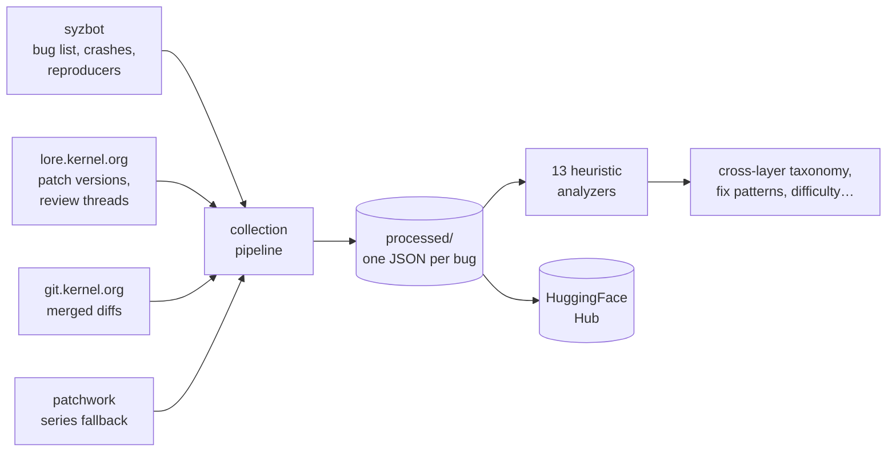
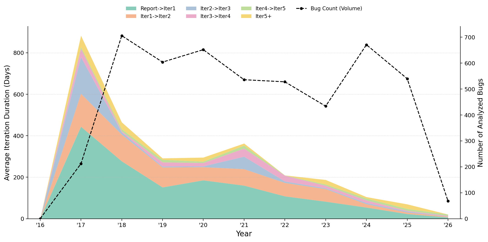

# SyzFix

<div class="sf-hero" markdown>

**The full lifecycle of 7,000+ fixed Linux kernel bugs** — from the syzbot
crash report, through every patch revision and reviewer discussion on
lore.kernel.org, to the commit merged into `torvalds/linux`.

[:simple-huggingface: Get the dataset](https://huggingface.co/datasets/xiaoguangwang/syzfix-dataset){ .md-button .md-button--primary }
[:simple-github: Browse the code](https://github.com/sysec-uic/syzfix){ .md-button }
[Quick start :material-arrow-down:](#start-in-minutes){ .md-button }

</div>

<div class="sf-stats" markdown>
  <div class="sf-stat"><span class="num">7,210</span><span class="label">fixed kernel bugs</span></div>
  <div class="sf-stat"><span class="num">5,204</span><span class="label">merged patch diffs</span></div>
  <div class="sf-stat"><span class="num">6,191</span><span class="label">review discussions</span></div>
  <div class="sf-stat"><span class="num">4,802</span><span class="label">C reproducers</span></div>
  <div class="sf-stat"><span class="num">1,157</span><span class="label">multi-version patch histories</span></div>
  <div class="sf-stat"><span class="num">≤9</span><span class="label">patch versions per bug</span></div>
</div>

*Counts as of July 2026 — the dataset tracks syzbot continuously and grows
with each incremental update.*

---

## One record = one bug's whole story

Most kernel-bug datasets stop at (crash, final patch). SyzFix keeps the
process in between — the part that shows *how* maintainers actually converge
on a fix:

```
[Sep 16, 2024]  syzbot: NULL pointer deref in filemap_read_folio
[Sep 17, 2024]  Developer → [PATCH v1]: check S_ISREG before proceeding
[Sep 17, 2024]  syzbot: patch confirmed working ✅
[Sep 17, 2024]  Developer → [PATCH v2]: also fix multi-device/blob case
[Oct 11, 2024]  Chao Yu: Reviewed-by ✅
[Final]         Commit 416a8b2c merged into torvalds/linux
```

Each entry carries the raw crash report (oops / KASAN / BUG), syzkaller and C
reproducers, every patch revision with its inline review thread, and the
final merged commit — aligned and machine-readable.

## How it's built



The pipeline is resumable and incremental: a weekly
`python -m dataset.update` pulls only the bugs fixed since the last run and
pushes the refreshed dataset to HuggingFace.
[Data collection →](collection.md)

<!--


*Average time spent in each revision stage (report → v1 → v2 → …) per year,
with the volume of analyzed bugs overlaid. Fix turnaround has dropped from
hundreds of days in syzbot's early years to weeks.*

## Preliminary findings

### Cross-layer bugs are common — and hard

Some kernel bugs crash in one architectural layer but must be fixed in
another (a fuse crash fixed in VFS core; an interrupt-context fault fixed in
TCP/TLS state handling). Classifying all 5,145 analyzable bugs against a
13-domain / 3-level kernel-layer taxonomy:

| Relation | Share | Meaning |
|---|---|---|
| same-layer | 79.5% | fix lands where the crash occurred |
| **cross-layer** | **11.4%** | fix in a different layer of the same domain |
| **cross-domain** | **9.1%** | fix in an entirely different subsystem |

Among cross-layer bugs, **37% have the fix completely off the crash
stack** — stack-following heuristics (and stack-following LLM agents)
cannot localize them. [Full analysis →](cross_layer.md)

### Crash reports carry enough signal to predict the fix layer

A frozen-encoder classification head trained on the crash report alone
predicts the *(domain, layer)* where the fix will land:

| Metric (held-out test split) | Score |
|---|---|
| Weighted layer accuracy | 0.78 |
| Top-1 exact layer | 0.80 |
| **Top-3 layer** | **0.94** |

Top-3 covering 94% of bugs means a predicted layer prior can cut the search
space for downstream patch-localization agents by an order of magnitude.
-->

## Start in minutes

```bash
git clone https://github.com/sysec-uic/syzfix.git && cd syzfix
python3 -m venv venv && source venv/bin/activate
pip install -e .

# pull the pre-built dataset from HuggingFace (~2 GB download)
python -m dataset.restore_processed --repo xiaoguangwang/syzfix-dataset
python -m dataset.view build-index
python -m dataset.view list
```

<div class="grid cards" markdown>

- :material-magnify: **[Exploring](exploring.md)** — browse, search, and
  inspect individual bugs from the CLI
- :material-chart-box: **[Analysis](analysis.md)** — 13 heuristic analyzers
  over the full corpus
- :material-cloud-download: **[Collection](collection.md)** — the crawl
  pipeline, rate limits, incremental updates
- :simple-huggingface: **[Dataset card](https://huggingface.co/datasets/xiaoguangwang/syzfix-dataset)**
  — schema, splits, and download options (HF link)

</div>

<!--
- :material-download: **[Reproducing](reproducing.md)** — use the pre-built
  HF dataset, no crawling required
- :material-layers-triple: **[Cross-layer](cross_layer.md)** — taxonomy,
  stack-overlap verification, hard-case mining
-->

## Citation & contact

Developed at [sysec-uic](https://github.com/sysec-uic). If you use SyzFix in
your research, please cite the repository until the accompanying paper is
available. Questions and issues → [GitHub issues](https://github.com/sysec-uic/syzfix/issues).
